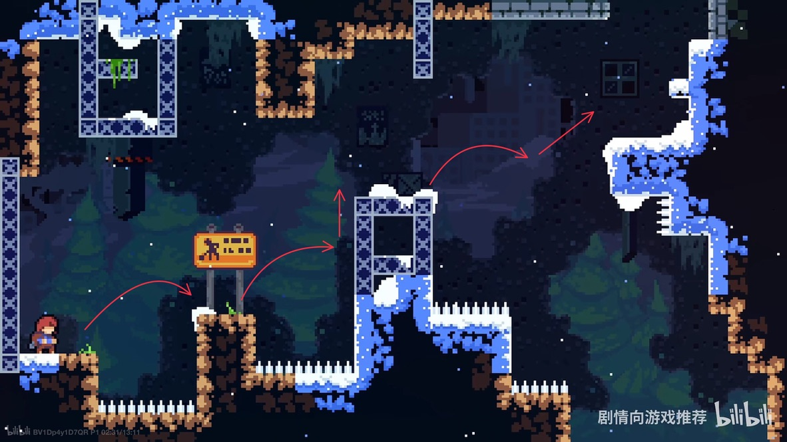
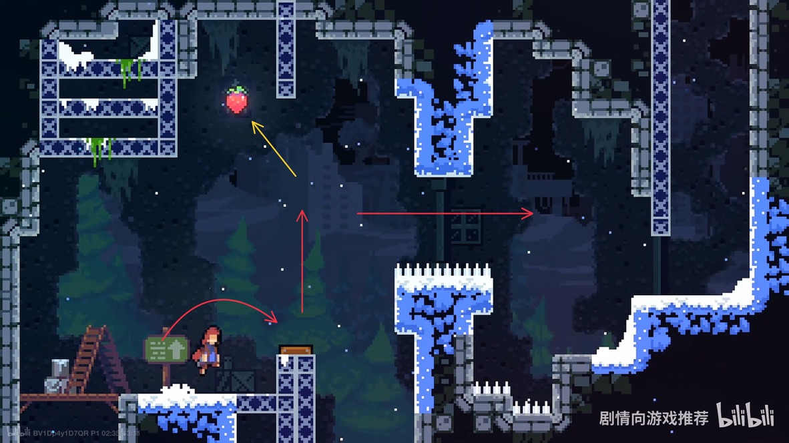
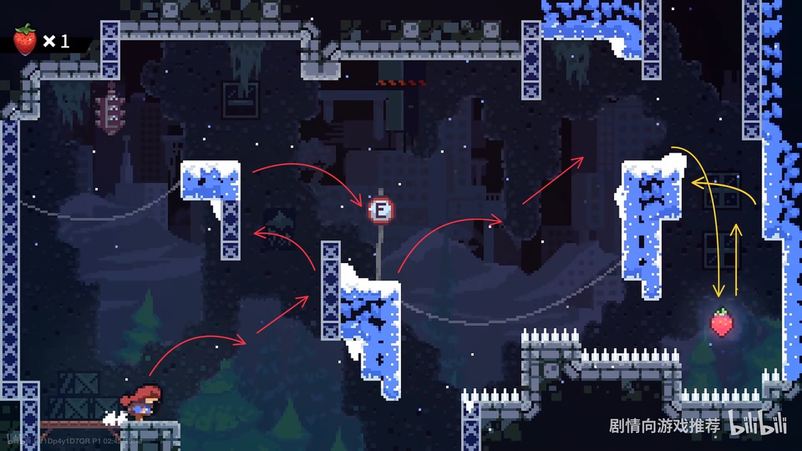
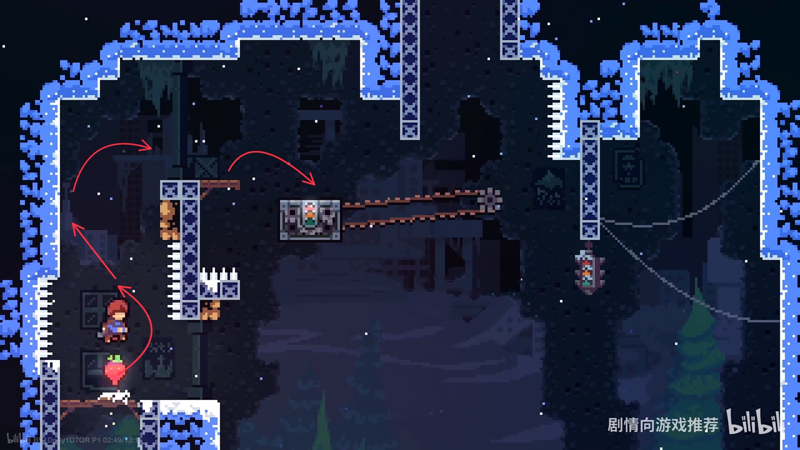
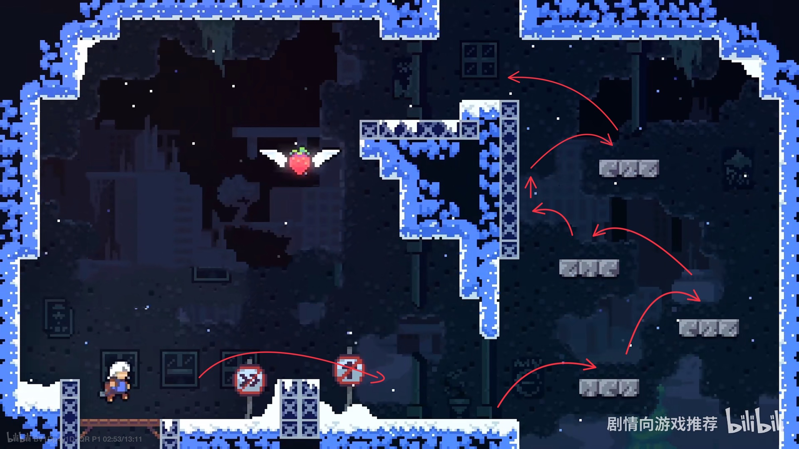
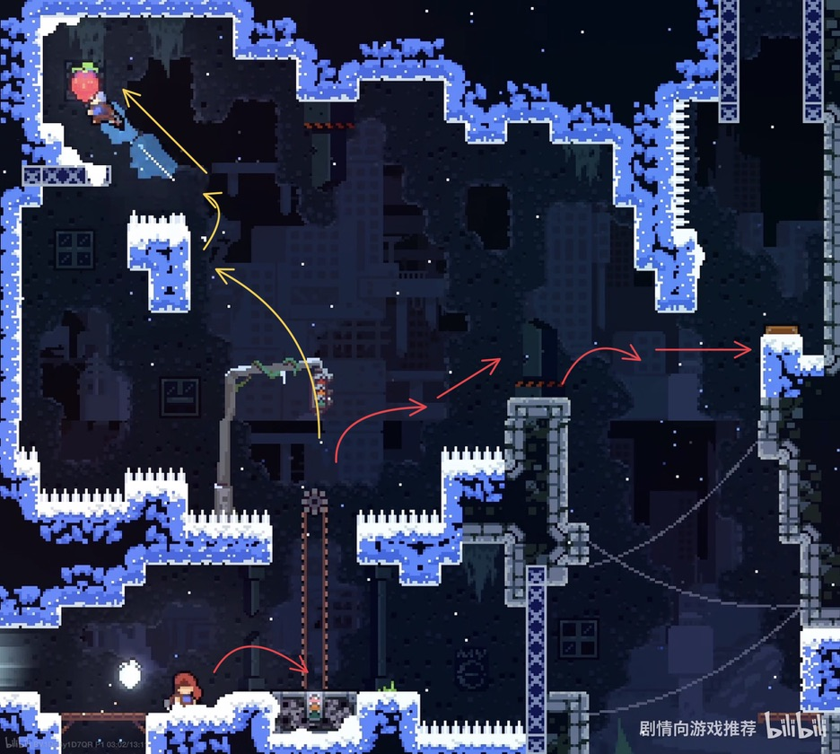
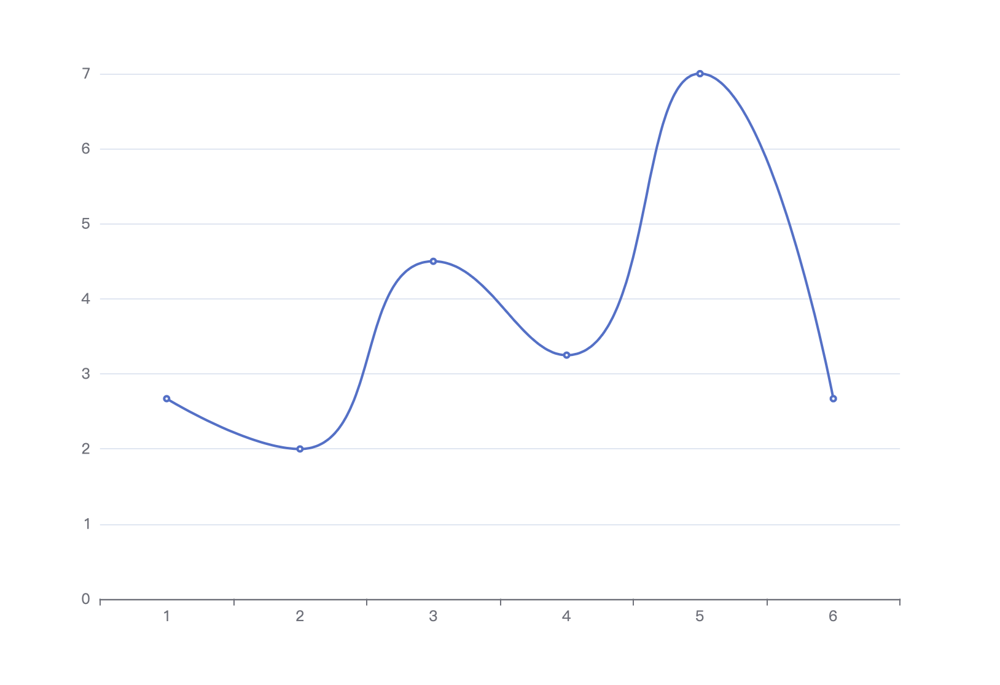
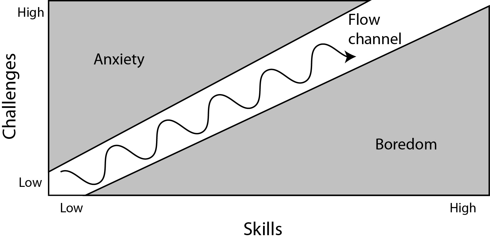

最近读《Reverse design. Super Mario World》，发现书中设计理念在《蔚蓝》中存在大量的应用，下面简单分析，加深自己的理解。  
## 什么是一个挑战
两个安全平台中间的部分是一个挑战。

## 挑战(Challenge)的分类 
1. Standard Challenge，蔚蓝中的跳，冲，爬
2. Expansion Challenge，如果一个standard跳跃是跳1个单位高度，那么expansion就是两个单位高度。
3. Evolution Challenge，一个标准挑战的进化，比如一个standard跳跃是跳1个单位高度，那么进化后的这个挑战可能需要在跳跃同时躲避障碍物。
4. Training Wheels Challenge，辅助轮挑战，就像学自行车时候后轮会有两个辅助轮。在蔚蓝中通常表现为挑战失败时惩罚的降低。
5. Punctuating Challenge，解释这个概念，需要先明确，挑战是在不断变难的，多个逐渐变难的挑战组成游戏的节奏，而 Punctuating Challenge 是这种节奏的一个标点符号，一个小憩，在蔚蓝较为明显的应用是获取B面磁带的关卡。
6. Crossover Challenge，因为书中是以马里奥为例，交叉挑战是指马里奥在平台跳跃游戏和动作游戏（踩栗子和乌龟等怪物）之间切换，蔚蓝是单一跳跃游戏，没有这种。
7. Reward by Fun，马里奥中会存在一个房间都是金币来放松，蔚蓝没有金币，题外话，《只狼》中的雾隐贵人应该算是这种挑战。与第5点的区别在于，5虽然中断了整体的节奏，但是难度并没有降低，而7是完全零难度。

## 结合《蔚蓝》分析
### 1A-1

本关包含3个挑战，分别是：跳，跳+爬，跳+冲，假定跳、爬、冲这三个基础动作难度系数都是1的话，本关的平均难度为 (1+(2+1)+(2+2))/3 = 2.67。

### 1A-2

本关引入了一个新的元素-弹簧跳台（图中褐色部分），玩家在弹簧条后有两种选择：1、向左上冲刺吃草莓，2、向右水平冲刺去下一关。由于跳到右边安全平台后，就无法再回来吃草莓，所以选择顺序应该是先1后2。  
这展示了辅助轮挑战的应用，两种选择的操作都是“弹簧跳+冲”，但是吃草莓的黄色路线，是没有失败惩罚的，没有吃到草莓下面会有平台接住玩家，可以不断练习、熟悉“弹簧跳+冲”，学习之后，选择右侧有失败惩罚的红色路线。  
本关包含两个挑战，都是弹簧跳+冲，平均难度为（2+2）/2 = 2。即使这两个挑战的难度明显不同，这里暂不讨论。
### 1A-3

本关包含3个挑战，分别是：跳+冲+蹬墙跳*2，跳+冲，跳+冲+蹬墙跳。  
这一关中出现了新的动作：蹬墙跳，其实回看会发现1A-2的结尾就是蹬墙跳的辅助轮挑战。  
第二个挑战的“跳+冲”组合要比1A-1中的挑战的横向挑战距离更远，是一个基础挑战的拓展，这里计算难度系数时乘一个1.5。  
第三个挑战值得注意的是冲操作与基础冲的区别：基础冲的目标平台在冲的方向上，比如向右上冲，安全平台在右侧。而这个挑战中的冲是向上的，落脚平台是右侧的墙壁，无法借助冲的力量，是一个进化挑战，难度系数乘1.5。  
平均难度为（4 +(（1+1）*1.5 + 1) + (（1+1.5+1）+2)）/ 3 = 4.5
### 1A-4

本关包括两个挑战：第一个挑战和上一关的最后一个相同，都是跳冲蹬墙跳，第二个挑战包含新元素：传送带滑块，需要的玩家操作是跳上滑快，然后滑块到终点后再起跳到墙上，由于是第一次出场，所以比较简单。  
平均难度为（3.5 + （2+1））/ 2 = 3.25
### 1A-5

本关再次出现了新元素，带翅膀的草莓，不过由于并不是新的挑战元素，所以并没有设计辅助轮，挑战需要跳\*4 + 蹬墙跳 + 跳\*2。  
翅膀草莓是禁用冲刺的，中断了“跳冲爬”技能组合的搭配节奏，所以也算一种Punctuating Challenge。  
平均难度为7
### 1A-6

本关设计类似1A-2，跳上传送带滑快后，有左右两个选择，先说左边草莓黄色路线，可以看到路线的第一个跳，需要的高度比右侧跳+冲还要高，这其实是在引导玩家发现可以借助传送带滑块的惯性，在滑动方向跳得更远。  
回看传送带滑快第一次出现的1A-4就有“滑块跳”的伏笔，玩家的最终操作是在滑块上起跳到墙壁，如果触发了滑块跳，就会撞到右侧的陷阱上。这也是把上一关算作Punctuating Challenge的原因。  
再来看右侧路线，右侧第一部分的挑战，是一个跳+冲，当然也可以用黄色路线刚学会的滑块跳代替，第二部分同样是一个跳+冲，但是多了一个障碍物，这个障碍物又不像1A-2中的横向冲刺障碍物是对挑战的进阶，感觉更像是对右下角碎雪隐藏通道的暗示，不得不感慨下蔚蓝的关卡设计真的太妙了。  
弹簧跳算是一种跳的进化挑战，难度算作1.5，第一个红色跳冲挑战可以替换为弹簧跳，则本关平均难度为（3.5 + 1.5 + （2+1） ）/ 3 = 2.67

### 总结
第一关的平均难度整体是上升趋势，出现下降的2是草莓初次出现，4和6是因为关卡包含滑块跳的教学。

曲线走势也符合著名的flow channel。

>演示截图来自 https://www.bilibili.com/video/BV1Dp4y1D7QR