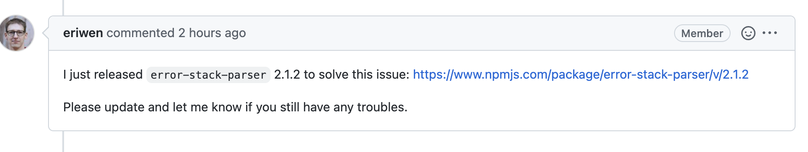

*10:49*  
运维：帮我看看这个项目的报错  
```
ERROR  TypeError: StackFrame is not a constructor
TypeError: StackFrame is not a constructor
    at Object.<anonymous> (/app/.jenkins/workspace/admin-manage-frontEnd/node_modules/error-stack-parser/error-stack-parser.js:76:24)
    at Array.map (<anonymous>)
    at Object.ErrorStackParser$$parseV8OrIE [as parseV8OrIE] (/app/.jenkins/workspace/admin-manage-frontEnd/node_modules/error-stack-parser/error-stack-parser.js:56:29)
    at Object.ErrorStackParser$$parse [as parse] (/app/.jenkins/workspace/admin-manage-frontEnd/node_modules/error-stack-parser/error-stack-parser.js:31:29)
    at getOriginalErrorStack (/app/.jenkins/workspace/admin-manage-frontEnd/node_modules/@soda/friendly-errors-webpack-plugin/src/core/extractWebpackError.js:31:29)
    at extractError (/app/.jenkins/workspace/admin-manage-frontEnd/node_modules/@soda/friendly-errors-webpack-plugin/src/core/extractWebpackError.js:22:20)
    at Array.map (<anonymous>)
    at processErrors (/app/.jenkins/workspace/admin-manage-frontEnd/node_modules/@soda/friendly-errors-webpack-plugin/src/core/transformErrors.js:31:17)
    at FriendlyErrorsWebpackPlugin.displayErrors (/app/.jenkins/workspace/admin-manage-frontEnd/node_modules/@soda/friendly-errors-webpack-plugin/src/friendly-errors-plugin.js:97:29)
    at doneFn (/app/.jenkins/workspace/admin-manage-frontEnd/node_modules/@soda/friendly-errors-webpack-plugin/src/friendly-errors-plugin.js:57:14)
    at AsyncSeriesHook.eval [as callAsync] (eval at create (/app/.jenkins/workspace/admin-manage-frontEnd/node_modules/tapable/lib/HookCodeFactory.js:33:10), <anonymous>:18:1)
    at AsyncSeriesHook.lazyCompileHook (/app/.jenkins/workspace/admin-manage-frontEnd/node_modules/tapable/lib/Hook.js:154:20)
    at emitRecords.err (/app/.jenkins/workspace/admin-manage-frontEnd/node_modules/webpack/lib/Compiler.js:304:22)
    at Compiler.emitRecords (/app/.jenkins/workspace/admin-manage-frontEnd/node_modules/webpack/lib/Compiler.js:499:39)
    at emitAssets.err (/app/.jenkins/workspace/admin-manage-frontEnd/node_modules/webpack/lib/Compiler.js:298:10)
    at hooks.afterEmit.callAsync.err (/app/.jenkins/workspace/admin-manage-frontEnd/node_modules/webpack/lib/Compiler.js:485:14)
npm ERR! code ELIFECYCLE
npm ERR! errno 1
npm ERR! admin-manage-frontend@1.0.0 int: `vue-cli-service build --mode int`
npm ERR! Exit status 1
npm ERR! 
npm ERR! Failed at the admin-manage-frontend@1.0.0 int script.
npm ERR! This is probably not a problem with npm. There is likely additional logging output above.
```
我：这项目不是我的啊亲  
运维：你组长不是不在，平常我也没少帮你  
我：好吧

*11:30*  
我：开了一上午会，下午来了看看。

*13:30*  
看了一下报错的地方，是依赖 `error-stack-parser`，他的依赖关系是：  

｜- @vue/cli-service    
｜ ｜- @soda/friendly-errors-webpack-plugin  
｜ ｜ ｜- error-stack-parser  

去github的issue里找，在error-stack-parser里一搜搜出了完全一致的问题，再点进去  

  

好家伙，“2 hours ago”  

遇到 bug 不要着急，吃个饭睡一觉下午回来 bug 会自己解决。