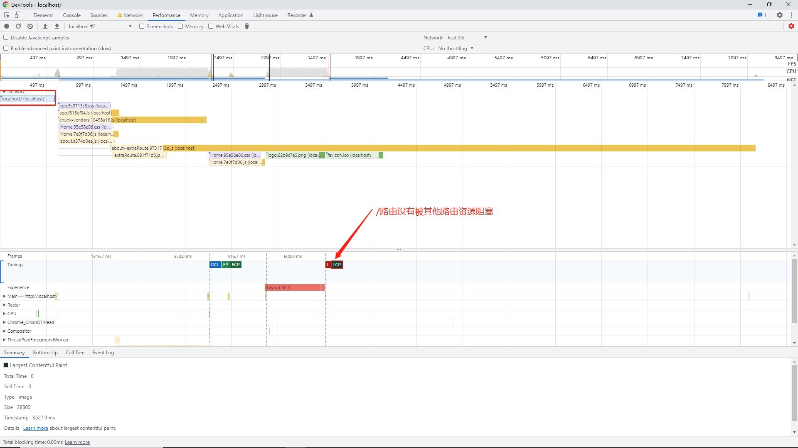
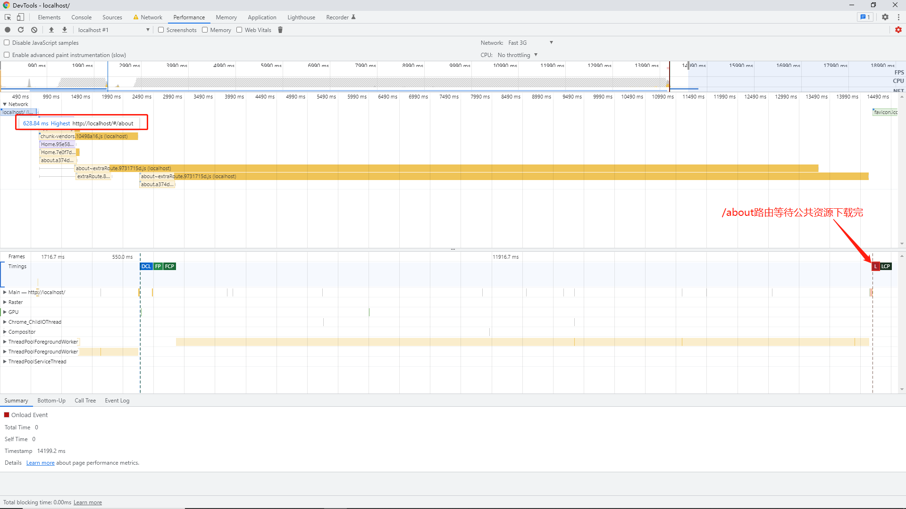

# split-chunks
vue-cli3默认webpack
```javascript
cacheGroups: {
  common: {
    name: 'chunk-common',
    minChunks: 2,
    priority: -20,
    chunks: 'initial',
    reuseExistingChunk: true
  }
}
```


## performance
home路由  
  
about路由  

